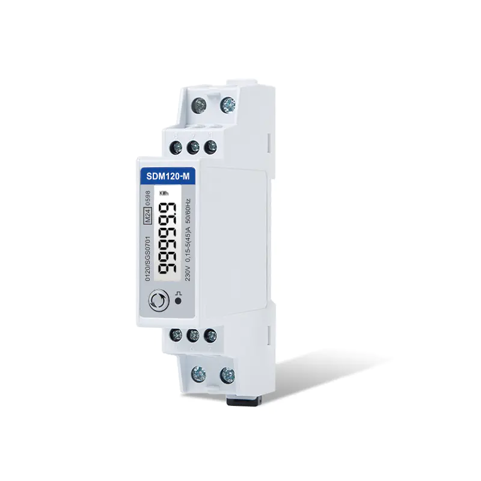
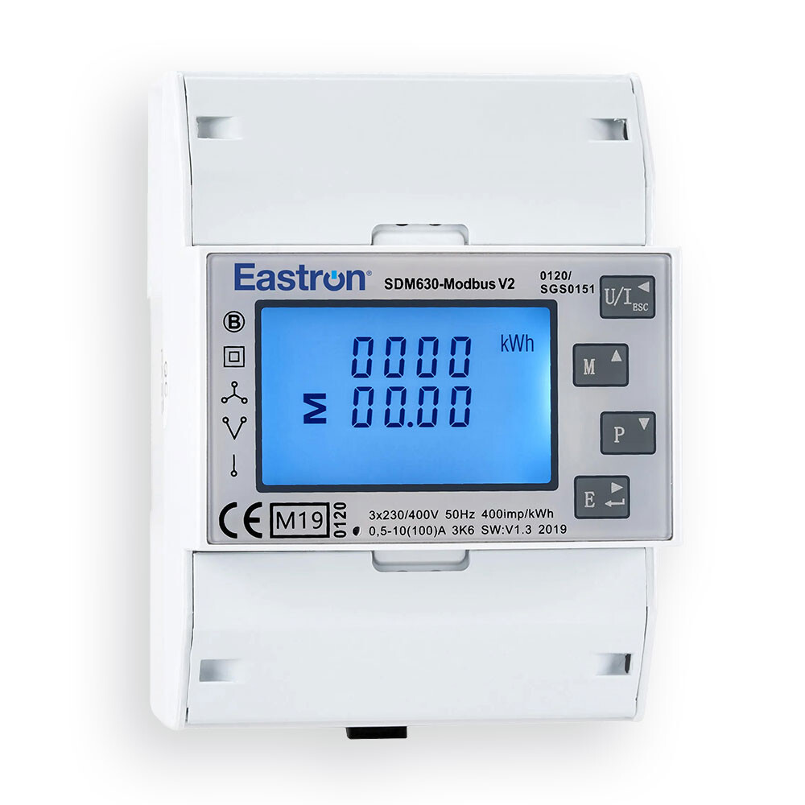

# Eastron SDM Modbus for Home Assistant

[![hacs][hacs-badge]][hacs-url]
[![release][release-badge]][release-url]
[![license][license-badge]](LICENSE)

Home Assistant integration for Eastron SDM energy meters reached over a
Modbus-to-Ethernet gateway (RTU over TCP). Several meters share one gateway;
each is addressed by its Modbus slave address and appears in Home Assistant as
its own device under a name you choose.

Supported meters:

| Model  | Meter code | Phases |
| ------ | ---------- | ------ |
| SDM120 | `0x0020`   | 1P2W   |
| SDM630 | `0x0070`   | 3P4W   |

<p>
  
  
</p>

## Requirements

Home Assistant 2025.6.0 or newer. The reactive energy counters use the
`reactive_energy` device class, which was added in that release; on older
versions Home Assistant rejects those six sensors.

The integration ships its own brand icon in `custom_components/eastron_modbus/brand/`.
Home Assistant only reads local brand images from 2026.3 onwards; on older
versions the icon is simply not shown and everything else works unchanged.

## Installation

### HACS

Add this repository as a custom repository of type *Integration*, install
**Eastron SDM Modbus**, then restart Home Assistant.

### Manual

Copy `custom_components/eastron_modbus` into your Home Assistant
`config/custom_components/` directory and restart.

## Configuration

*Settings → Devices & Services → Add Integration → Eastron SDM Modbus*

1. Enter the gateway's host and port (default `8899`) and the poll interval.
   The gateway must be configured for **RTU over TCP** — not Modbus TCP.
2. For each meter, enter its Modbus slave address and a name. The integration
   probes the address, detects the model from the meter's own identity
   registers, and refuses addresses where nothing answers.
3. Repeat until every meter is added.

The poll interval can be changed later under the entry's *Configure* option.

## How it works

All meters behind one gateway share a single TCP connection and one lock,
because the gateway funnels them onto a single RS485 bus. Only one request is
in flight at a time, with a short gap between requests.

Each meter is polled by its own coordinator. Reads are grouped into blocks of
adjacent registers — the meters cap one response at 40 registers, so a full
SDM630 refresh costs 6 requests and an SDM120 costs 4, rather than one per
value. Measured against real hardware: 1.4 s for the SDM630, 0.7 s per SDM120.

Entities are keyed by the meter's hardware serial number rather than its slave
address, so history survives readdressing a meter on the bus.

### Only one master per bus

RS485 has no arbitration between masters. If something else polls the same
meters — a leftover `modbus:` block in `configuration.yaml`, another gateway
client, a vendor tool — the two masters' frames interleave and each sees
truncated replies and timeouts. Truncated reads are rejected rather than
decoded into wrong values, and the log then asks whether another master is on
the bus. Remove the other poller; there is no setting that makes sharing work.

Most registers are created disabled by default; see *Entities* below for what
is enabled and how to turn on the rest.

## Entities

The SDM120 exposes 18 values and the SDM630 62, but most are created disabled
so a fresh install stays readable. Enabled by default are the everyday
quantities — voltage, current, power, power factor, frequency and the import
and export energy counters:

| Meter  | Enabled | Total |
| ------ | ------- | ----- |
| SDM120 | 7       | 18    |
| SDM630 | 19      | 62    |

On the SDM630 those are the per-phase values (L1/L2/L3) plus the averages and
system totals for power and power factor.

Everything else — apparent and reactive power, reactive energy, the total
energy registers, line-to-line voltages, neutral current, THD, demand figures,
phase angles, apparent energy, ampere hours and the per-phase energy counters
— is created but disabled. Enable what you need per entity on the device page.

### Diagnostics

Each meter also carries six diagnostic entities reporting how its own polling
is going. They live under *Diagnostic* on the device page and are enabled by
default, since they are what tells you a meter has gone quiet:

| Entity | Meaning |
| ------ | ------- |
| Poll status | `ok`, `timeout` (nothing answered), `invalid` (truncated frame — usually a second master on the bus) or `error`. Carries the last error text as an attribute. |
| Poll duration | How long the last full refresh took, in milliseconds |
| Last successful poll | Timestamp of the last good read |
| Consecutive failures | Resets to zero on the next success |
| Failed polls | Running total since Home Assistant started |
| Poll success rate | Share of polls that succeeded, in percent |

Unlike the measurement entities, these stay available while a meter is
failing — otherwise they could not report the failure.

### Device classes

Device classes follow Home Assistant's own validation tables:

| Values | Device class | State class |
| ------ | ------------ | ----------- |
| Voltage, current, power, apparent/reactive power, frequency | matching class | `measurement` |
| Power factor | `power_factor` (unitless) | `measurement` |
| kWh counters | `energy` | `total_increasing` |
| kvarh counters | `reactive_energy` | `total_increasing` |

Active energy counters can be used directly in the Energy dashboard.

Four value types carry a unit but no device class, because Home Assistant has
no matching one: apparent energy (kVAh), ampere hours (Ah), THD (%) and phase
angle (°). Assigning a device class to these would make Home Assistant reject
the state.

## Register documentation

The register maps were transcribed from the Eastron protocol specifications and
verified against live hardware:

- `docs/SDM120-MODBUS_Protocol.pdf` — SDM120 V2.4
- `docs/SDM630_MODBUS_Protocol.pdf` — SDM630 V1.8

All measured values are 32-bit IEEE-754 floats spanning two input registers,
read with function code 04, most significant register first.

The PDFs are vendor documents and are not redistributed here; they are kept
locally in `docs/` and excluded from the repository.

## Changes

Every version and its changes are listed in the [changelog](CHANGELOG.md).

## Development

Development happens on a private GitLab instance; GitHub carries the published
releases so that HACS can find them.

A tag on `main` triggers the pipeline in [`.gitlab-ci.yml`](.gitlab-ci.yml):

1. **validate** — syntax check, JSON validation, comparison of the translation
   files against each other, and a check that the manifest version matches the
   tag.
2. **release-to-github** — mirrors the commit and the tag to GitHub, creates a
   release there and attaches `eastron_modbus.zip` as an asset. The release
   notes come from the matching section of `CHANGELOG.md`.

A release is therefore made like this:

```sh
# Raise the version in custom_components/eastron_modbus/manifest.json,
# add a section to CHANGELOG.md, commit both
git tag v0.2.0
git push origin main --follow-tags
```

If the manifest version differs from the tag, the pipeline stops before
anything is published.

The pipeline needs the CI/CD variable `GITHUB_PAT` — a GitHub token with `repo`
scope, stored masked and protected.

## Disclaimer

This project is not affiliated with Eastron Electronic Co., Ltd. "Eastron" and
"SDM" are trademarks of their respective owners. Use at your own risk.

## License

[MIT](LICENSE)

[hacs-badge]: https://img.shields.io/badge/HACS-Custom-41BDF5.svg
[hacs-url]: https://hacs.xyz
[release-badge]: https://img.shields.io/github/v/release/ChristophGoth/ha-eastron-modbus?display_name=tag
[release-url]: https://github.com/ChristophGoth/ha-eastron-modbus/releases
[license-badge]: https://img.shields.io/badge/license-MIT-blue.svg
